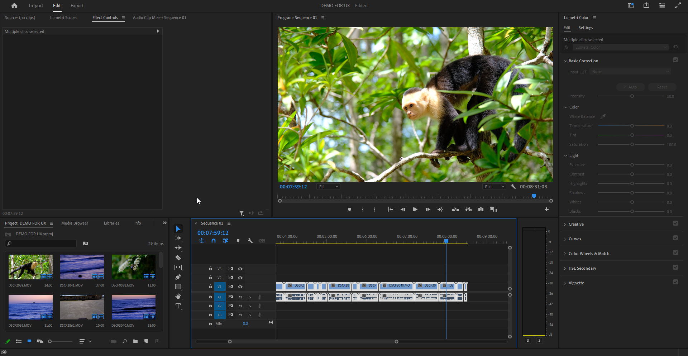
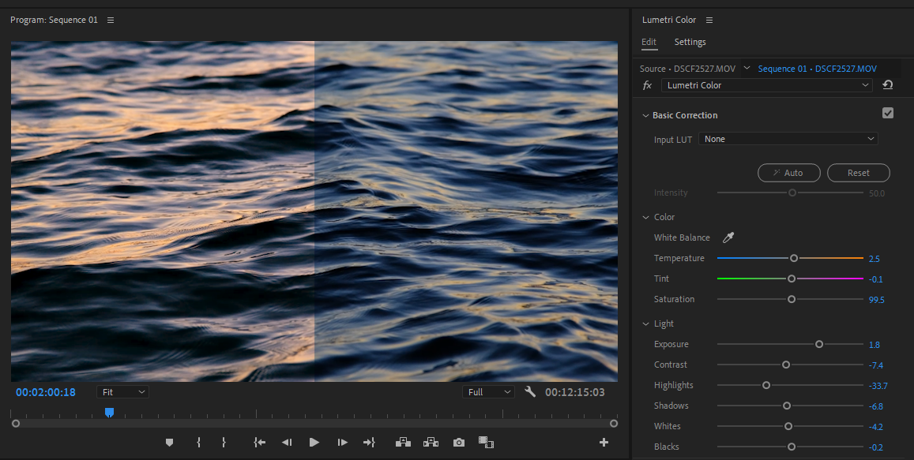
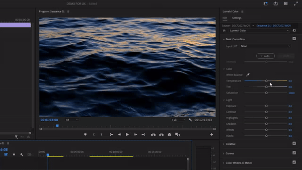

# Color Grading in Adobe Premier

## Riley Spas, March 15, 2024

### Something I like to do in my free time, as well as a side hustle is shoot concerts and edit promo videos together for local bands. I use Adobe Premier as my primary video editing software.

### One of the most interesting features of a software like this is the ablility to do color grading on video. Color grading is a post-production process that entails changing the colors in a video such that they match a certain tone or appearance, or even so they appear better on specific devices.  Here is a quick side by side of what I mean:

### Above is a screenshot of a video I took on lake almanor. I wanted to make this footage look like it was taken at sunset when really it was around 3pm. The sliding bars on the right of the screenshot above, create an effect on the video in real time, which is a great example of **visibility of system status**.  This is widely considered good practice in the scope of usability and, in this case, ensures that the user will always have instant feedback from the software. 
### Directly above the sliders you can see two buttons labeled: auto and reset respectively. Premier Pro also supports the conventional windows keyboard shortcuts including ctrl-z for undo and ctrl-y for redo. These all contribute to a design concept called **user control and freedom**, giving the user an "emergency exit" that they would be able to find easily.  The auto and reset buttons also go hand in hand with the principle of **recognition rather than recall**. Even if it was your first time using Premier Pro you would be able to use the buttons.
## Here is the whole proccess:

### I started by clicking on the auto button, which was a good place to start.  From that point I played with the exposure and highlight sliders, which are different ways to affect the lighting of a piece of media.  I then moved over to the color wheels.  Color wheels are a **convention** that has been used in nearly every color correction software. I have used DaVincii Resolve, another color correction software in the past, so I had a **mental model** of how I imagined these would work. I expected the color that I selected on the wheel to have an effect on the whole selected clip. Thankfully both of these softwares employed **consistancy and standards**, because it worked exactly as my Davincci Resolve **mental model** would have predicted for another software.
